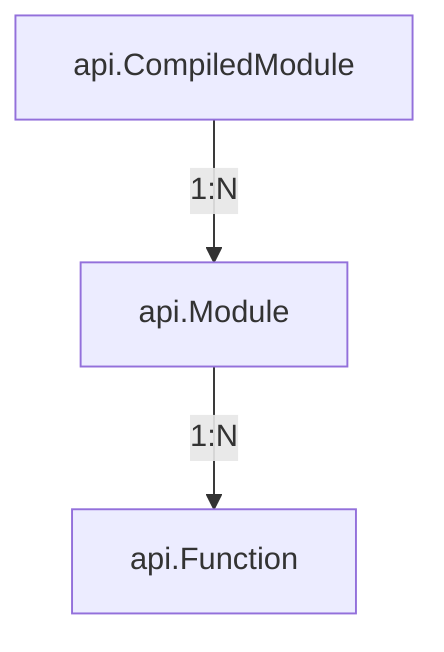
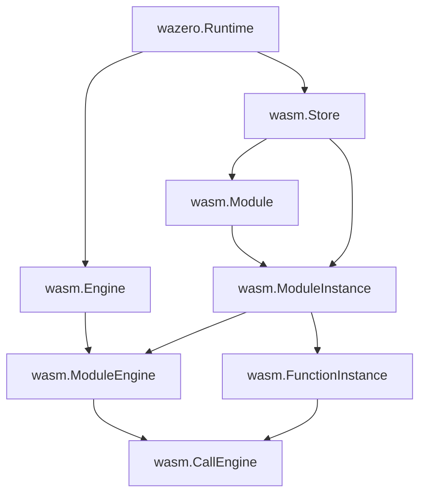

# The architecture of wazero

This documents describes the internal architecture of wazero for those who are interested in how it works, especially
who want to contribute to wazero's source code. For technical decisions, and rationales for end users, please refer to [RATIONALE.md][rationale].

## wazero.CompiledModule, api.Module and api.Function

The most confusing concept in wazero to newbies is how to differentiate api.CompiledModule, api.Module and api.Function. Here
we explain the difference in short:

wazero.CompiledModule has the [validated][spec-validation] static contents, including the original Wasm function bytes from Wasm binary
where validated means the given Wasm binary is sound in the sense of the [Wasm specification][spec-validation].
It also contains the intermediate representation suitable for the further processing. For example, when compiler is used,
CompiledModule also holds the memory-mapped executables which will be executed via api.Function. CompiledModule

api.Module can be created multiple times from wazero.CompiledModule. It has a unique name as an identifier so that it can be
imported with other api.Module during creation. It is essentially the _instantiated_ CompiledModule and ready to be executed via
exported functions. This has an isolated unique scope of memory, table, and globals (which may or may not be imported from other api.Module).

api.Function can be created multiple times from api.Module for a given name of the exported function. It has a unique scope of
execution context (e.g. "stack" of the virtual machine), but shares the entire underlying objects for a api.Module. For example,
the linear memory buffer is shared by api.Functions created from the same api.Module.

## Terminology (public vs internal vs specification)

In this section, we explain the terminology existing at three levels: public api, internals, and Wasm spec.

|      Public API       |      Internal Structure      |          WebAssembly specification          |
|:---------------------:|:----------------------------:|:-------------------------------------------:|
|    wazero.Runtime     |         `wasm.Store`         |             [Store][spec-store]             |
| wazero.CompiledModule |        `wasm.Module`         |            [Module][spec-module]            |
|      api.Module       |    `wasm.ModuleInstance`     |   [Module Instance][spec-module-instnace]   |
|     api.Function      |   `wasm.FunctionInstance`    | [Function Instance][spec-function-instance] |

where
- `wazero.` refers to the top `wazero` package
- `api.` refers to the `api` package at [api](./api)
- `wasm.` refers to the internal `wasm` package at [internal/wasm](./internal/wasm)

## Engines

One of the most interesting and important concepts in wazero's implementation is called `engine`. There are three types
of engines, and hey are called `wasm.Engine`, `wasm.ModuleEngine`, and `wasm.CallEngine`. The following is the relationship with
the aforementioned data structures:

|   Internal Structure    |       Engines       |                       Role                        |       Created by/at       |
|:-----------------------:|:-------------------:|:-------------------------------------------------:|:-------------------------:|
|      `wasm.Store`       |    `wasm.Engine`    |                Static compilation                 | Along with wazero.Runtime |
|  `wasm.ModuleInstance`  | `wasm.ModuleEngine` | Setup invocation of an exported function instance |      By wasm.Engine       |
| `wasm.FunctionInstance` |  `wasm.CallEngine`  |    Invocation of an exported function instance    |   By wasm.ModuleEngine    |

Basically, all of these three engines are in charge of how Wasm modules are compiled, cached and executed at runtime. As of now,
wazero has two implementations of these engine interfaces: interpreter and compiler. These two have totally different internals,
and we won't dive deeper into the specific implementation in this document since it's continuously changing and better consult the code directly.

The following is "which creates which" graph for internal types and interfaces:

[rationale]: ./RATIONALE.md
[spec-validation]: https://www.w3.org/TR/2019/REC-wasm-core-1-20191205/#validation%E2%91%A1
[spec-store]: https://www.w3.org/TR/2019/REC-wasm-core-1-20191205/#store%E2%91%A0
[spec-module]: https://www.w3.org/TR/2019/REC-wasm-core-1-20191205/#modules%E2%91%A8
[spec-module-instnace]: https://www.w3.org/TR/2019/REC-wasm-core-1-20191205/#syntax-moduleinst
[spec-function-instance]: https://www.w3.org/TR/2019/REC-wasm-core-1-20191205/#function-instances%E2%91%A0
